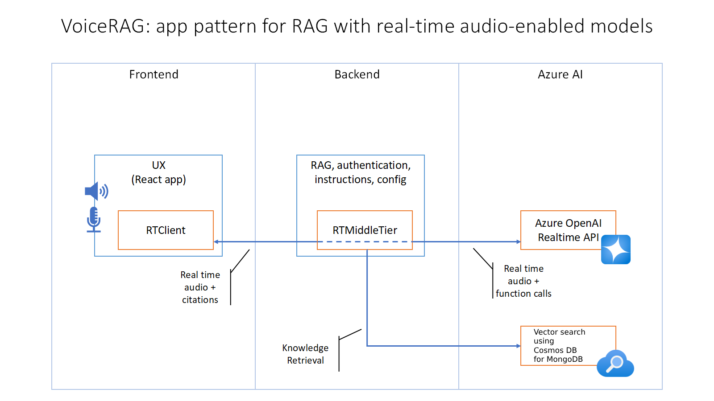
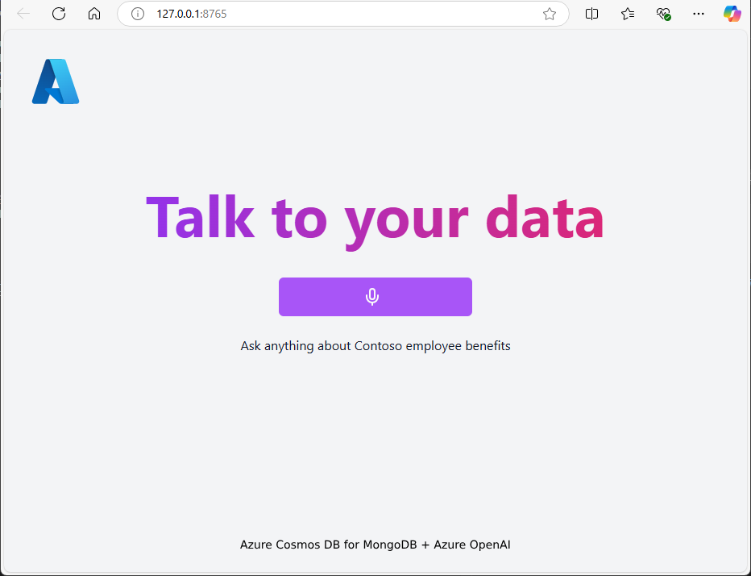

# VoiceRAG: Implementing RAG with Voice Integration Using Azure Cosmos DB for MongoDB and GPT-4o Realtime API

This repository provides a comprehensive guide to implementing **retrieval-augmented generation (RAG)** in applications with voice interfaces, powered by the **GPT-4o Realtime API for audio** and **Azure Cosmos DB for MongoDB** as a storage solution for vector embeddings.

The application leverages the **text-embedding-ada-002** model from Azure OpenAI to generate document embeddings that facilitate the retrieval of relevant documents during the RAG process.



## Getting Started

Follow these four key steps to run this example in your own environment: preparing pre-requisites, setting up the vector store, configuring the environment, and running the application.

### 1. Pre-requisites

Before proceeding, ensure that you have access to the following Azure services:

1. [Azure OpenAI](https://ms.portal.azure.com/#create/Microsoft.CognitiveServicesOpenAI):
    - Two model deployments: one for **gpt-4o-realtime-preview** and another for embeddings (e.g., `text-embedding-ada-002`).
2. [Azure Cosmos DB for MongoDB API](https://ms.portal.azure.com/#create/Microsoft.CosmosDBMongoAPI):
    - This will store your document embeddings and metadata for vector search.

### 2. Configuring the Vector Store with Azure Cosmos DB for MongoDB

In this application, document embeddings are stored in **Azure Cosmos DB for MongoDB**. The process involves configuring Cosmos DB to host the knowledge base (e.g., documents or other content) and the corresponding embeddings for vector search.

#### Steps to Store Documents:

1. **Create a MongoDB Collection**: Set up a new database and collection in Azure Cosmos DB for MongoDB. This collection will hold both the documents and their vector embeddings.
2. **Upload Documents**: Add your documents to the `./data/` folder in the project.
3. **Generate Embeddings**: When documents are processed, embeddings will be created using the **text-embedding-ada-002** model. These embeddings consist of 1536-dimensional vectors, enabling semantic search via cosine similarity.

### 3. Setting Up the Environment

To enable the application to communicate with the necessary Azure services, set the following variables as environment variables or add them to a `.env` file in the root directory:

```bash
AZURE_OPENAI_ENDPOINT=wss://<your-instance-name>.openai.azure.com
AZURE_OPENAI_DEPLOYMENT=gpt-4o-realtime-preview
AZURE_OPENAI_API_KEY=<your-api-key>
MONGO_CONNECTION_STRING=<your-mongo-connection-string>
MONGO_DB_NAME=<your-database-name>
MONGO_COLLECTION_NAME=<your-collection-name>
```

-   **AZURE_OPENAI_ENDPOINT**: The WebSocket endpoint for Azure OpenAI's GPT-4o Realtime API.
-   **AZURE_OPENAI_DEPLOYMENT**: The deployment name for the GPT-4o model.
-   **AZURE_OPENAI_API_KEY**: Your API key for Azure OpenAI.
-   **MONGO_CONNECTION_STRING**: The connection string for your Azure Cosmos DB for MongoDB instance.
-   **MONGO_DB_NAME**: The name of the database for storing embeddings.
-   **MONGO_COLLECTION_NAME**: The collection for storing documents and embeddings.

### 4. Running the Application

Once your development environment is set up, follow these steps to run the application:

#### Running in VS Code Dev Containers

You can run the project locally using the [Dev Containers extension](https://marketplace.visualstudio.com/items?itemName=ms-vscode-remote.remote-containers):

1. Start Docker Desktop (if not already installed).
2. Open the project using the link below:

    [](https://vscode.dev/redirect?url=vscode://ms-vscode-remote.remote-containers/cloneInVolume?url=https://github.com/azure-samples/aisearch-openai-rag-audio)

3. Once the project files load (this may take several minutes), open a new terminal and follow the next steps.

#### Running Locally

1. Install the required tools:

    - [Node.js](https://nodejs.org/en)
    - [Python 3.11 or later](https://www.python.org/downloads/)
    - [Powershell](https://learn.microsoft.com/powershell/scripting/install/installing-powershell)

2. Clone the repository:

    ```bash
    git clone https://github.com/s-spoon/cosmosdb-openai-rag-audio.git
    ```

3. Set up a Python virtual environment and activate it:

    ```bash
    python -m venv .venv
    source .venv/bin/activate
    ```

4. Start the application:

    ```pwsh
    cd app
    pwsh .\start.ps1
    ```

5. To incorporate basic knowledge documents into the RAG process, place the relevant PDF files in the ./data/ directory. The app will automatically process and store these documents in the vector store. This enables efficient retrieval of relevant information during searches based on specified query parameters. These documents will serve as the foundational data source for generating responses.

6. Access the app at [http://localhost:8765](http://localhost:8765).

Once the application is running, navigating to the URL will display the app's start screen:



### Frontend: Direct Communication with AOAI Realtime API

If needed, you can configure the frontend to communicate directly with the **AOAI Realtime API**. However, this bypasses the RAG process and exposes your API key, making it unsuitable for production environments.

Add the following parameters to the `useRealtime` hook in your frontend:

```typescript
const { startSession, addUserAudio, inputAudioBufferClear } = useRealTime({
    useDirectAoaiApi: true,
    aoaiEndpointOverride: "wss://<NAME>.openai.azure.com",
    aoaiApiKeyOverride: "<YOUR API KEY, INSECURE!!!>",
    aoaiModelOverride: "gpt-4o-realtime-preview",
    ...
});
```

### Important Notes

The sample PDF documents included in this demo are generated by a language model (Azure OpenAI Service) and are for demonstration purposes only. They do not reflect the opinions or beliefs of Microsoft. Microsoft makes no guarantees regarding the accuracy, completeness, or suitability of the information provided in this demo.

---
